# Civil Liberties Knowledge Assistant

I built a citation-grounded RAG assistant to help researchers, journalists,
and civic-tech practitioners investigate internet censorship and digital
rights in East Africa (Kenya, Uganda, Tanzania, Ethiopia, Rwanda;
2022–2026). It retrieves and answers from a curated corpus of OONI, Access
Now, CIPESA, and Freedom House reports — every answer cites the specific
excerpt it draws from, and I made sure thin or single-sourced evidence gets
flagged rather than smoothed into a confident-sounding narrative.

Built for DataTalksClub's LLM Zoomcamp 2026 capstone project.

> **Status, 2026-07-26:** I've built and verified ingestion, retrieval,
> generation, LLM evaluation, interface, monitoring, and containerization
> (see [Quickstart](#quickstart), [Monitoring](#monitoring)). Deployment
> is the one piece still not built (Tier 3). I've stated plainly, section
> by section, what exists today versus what I still have in progress, per
> [`docs/adr/0012-rubric-driven-completion-plan.md`](docs/adr/0012-rubric-driven-completion-plan.md).

## Contents

- [Problem](#problem)
- [Demo](#demo)
- [Evaluation](#evaluation)
- [Testing](#testing)
- [Monitoring](#monitoring)
- [Quickstart](#quickstart)
- [Data and configuration](#data-and-configuration)
- [Deployment](#deployment)
- [Architecture](#architecture)
- [Project structure](#project-structure)
- [Decisions and trade-offs](#decisions-and-trade-offs)
- [CI/CD](#cicd)
- [Limitations](#limitations)

## Problem

Reporting on internet censorship and digital rights in East Africa is
produced by several independent organizations — OONI publishes network
measurement data, Access Now tracks shutdowns, CIPESA covers regional
policy, Freedom House scores countries annually — each with its own
format, scope, and update cadence. A researcher or journalist trying to
answer a specific question (did this event actually involve app-level
blocking or a full shutdown? which organizations have corroborated a
claim, and which haven't?) currently has to manually cross-reference
several separate sites and PDF reports, with no single place to ask a
direct question and get a sourced answer.

That manual cross-referencing has a second, easy-to-miss failure mode
beyond being slow: it's easy to accidentally flatten disagreement or thin
evidence into a single confident-sounding narrative, because nothing
forces the reader to notice when only one organization covers an event, or
when two sources describe it differently. My core design principle
follows directly from that: **every answer must cite the exact excerpt
it's drawn from, and evidence that's thin (one source) or contradictory
(sources disagree) must be flagged explicitly, not smoothed over.** The
[Architecture](#architecture) and
[Decisions and trade-offs](#decisions-and-trade-offs) sections below cover
how I actually enforced that principle in code, not just stated it as
intent.

## Demo

**No live interface yet** (see [Limitations](#limitations)) — this is one
real, verified question/answer pair I pulled directly from
`data/eval/generation_results.jsonl` (question `general-0094`), not a
constructed example. I spot-checked every `[n]` marker below by hand
against the actual cited chunk text before including it here; all eight
resolve to real supporting passages. I'll replace this with a screenshot/
video of a live interface once one exists
(`docs/adr/0012-rubric-driven-completion-plan.md`, Tier 2).

**Question:** What surveillance tools is the Rwandan government known to use?

**Answer:**

> The excerpts say the Rwandan government is known to use commercial
> spyware tools, especially Pegasus, the surveillance software made by
> NSO Group, against opposition figures, journalists, and human rights
> defenders.[1][2][3][5][6][8][10]
>
> They also say the government closely monitors social media discussions,
> with progovernment commenters frequently appearing on major
> platforms.[1][2][3][8]
>
> One excerpt says Rwanda has taken steps to restrict anonymity by
> implementing SIM card registration requirements.[9]
>
> Another excerpt says that in 2021, the Rwandan government reportedly
> targeted the mobile devices of prominent journalists in Uganda with
> malware.[9]
>
> The excerpts do not provide a full list of surveillance tools, and one
> explicitly says the full extent of the authorities' surveillance
> capabilities is unknown.[1][2][3][8]

**Sources:**

```
[1] Freedom House, "Rwanda: Freedom on the Net 2022 Country Report" (2022-10-01). https://freedomhouse.org/country/rwanda/freedom-net/2022
[2] Freedom House, "Rwanda: Freedom on the Net 2024 Country Report" (2024-10-01). https://freedomhouse.org/country/rwanda/freedom-net/2024
[3] Freedom House, "Rwanda: Freedom on the Net 2023 Country Report" (2023-10-01). https://freedomhouse.org/country/rwanda/freedom-net/2023
[5] Freedom House, "Rwanda: Freedom on the Net 2024 Country Report" (2024-10-01). https://freedomhouse.org/country/rwanda/freedom-net/2024
[6] Freedom House, "Rwanda: Freedom on the Net 2023 Country Report" (2023-10-01). https://freedomhouse.org/country/rwanda/freedom-net/2023
[8] Freedom House, "Rwanda: Freedom on the Net 2022 Country Report" (2022-10-01). https://freedomhouse.org/country/rwanda/freedom-net/2022
[9] CIPESA, "State of Internet Freedom in Africa 2024: Technology and Elections" (2024-10-01), p. 22. https://cipesa.org/wp-content/files/reports/State_of_Internet_Freedom_in_Africa_Report_2024.pdf
[10] Freedom House, "Rwanda: Freedom on the Net 2022 Country Report" (2022-10-01). https://freedomhouse.org/country/rwanda/freedom-net/2022
```

*Sourcing: this answer cites 4 documents from 2 organizations (2022-2024).*

One nuance this answer doesn't surface, which I found while spot-checking:
one cited excerpt (marker [5], the 2024 Freedom House report) also notes
NSO Group stated Rwanda has not been a client since 2021, corroborated by
Citizen Lab — the answer's own citations remain accurate (it only claims
historical, not current, Pegasus use), but this is exactly the kind of
finer distinction the claim-level judge's 0.946 (not 1.0) precision score
reflects (see [Evaluation](#evaluation)) — I'm stating it here rather than
smoothing it over.

## Evaluation

### Retrieval

I evaluated three retrieval approaches — keyword/text search, vector
search, and a hybrid of the two (Reciprocal Rank Fusion) — against a
101-question ground-truth set (mechanically filtered from an initial
150-question generated set to remove residual circularity) spanning
general, multi-country, and OONI-methodology question categories
(`src/retrieval/ground_truth.py`, `evaluate.py`).

**Recorded default: hybrid search, RRF k=10** — I chose this for
best-or-near-best Mean Reciprocal Rank across all three question
categories, not just the aggregate. Real measured numbers:

- Aggregate Hit Rate: ~0.644–0.66, depending on `k`.
- Neighbor-aware Relaxed Hit Rate: ~0.812 (most of the gap between strict
  and relaxed scoring turned out to be same-document chunk overlap being
  scored as a miss, not a true retrieval failure — I confirmed this with a
  follow-up mechanism check).
- A real, disclosed limitation: on the `multi_country` question slice
  specifically, plain text search beats every hybrid configuration. I
  investigated this across two rounds of diagnostics and root-caused it as
  a genuine, **not retrieval-fixable** property of how RRF concentrates
  results toward cross-backend agreement on that particular question
  category — not an embedding-quality defect. I'm documenting it, not
  silently patching over it.

**Document re-ranking ablation (`_boost_by_country` in `search.py`).** I
evaluated the existing country-metadata boost — chunks tagged with a
query's detected country get moved toward the front of the candidate list,
a re-rank, never a filter — as its own best-practice item via a three-arm
comparison (baseline: unexpanded candidate pool, no re-rank; pool-only:
expanded candidate pool, no re-rank; current system: expanded pool +
re-rank), isolating the re-rank's own effect from the candidate-pool
expansion it rides on. Metadata coverage isn't a risk here: 100% (3,783/
3,783) of indexed chunks carry a non-empty `countries` field, so the
re-rank's total-reorder mechanism has no chunk to wrongly demote out of
`top_k`. On the 65-of-101 "firing" questions (query names a corpus country
*and* the candidate pool actually contains a matching chunk — the only
questions where the re-rank can possibly do anything), current-system vs.
pool-only: **Hit Rate 0.631 → 0.646, MRR 0.266 → 0.269** — a small, real
improvement with **3 wins, 0 losses, 62 ties** per-question (reciprocal
rank of the gold chunk). Diluted full-set numbers (n=101, most questions
never trigger the boost): Hit Rate 0.644 → 0.653, MRR 0.270 → 0.272. Full
report: `data/eval/reranking-ablation-report.md`.

Full methodology and numbers: `docs/retrieval-design.md` and
`docs/PROJECT_CONTINUITY.md` Section 1.

### LLM evaluation

I built a claim-level citation-precision judge (`src/evaluation/judge.py`,
isolated-entailment protocol, three-way supported/partial/unsupported
verdict) and ran it for real against 481 claims across 122 questions (see
`docs/adr/0010-citation-judge-protocol-and-contradiction-test-gap.md` and
`0011-claim-level-precision-and-judge-validity-fallbacks.md` for the
protocol design). My confidence in the citation-precision number rests on
three distinct sources — I've labeled them explicitly below so none gets
mistaken for another:

**1. AI Judge (`gpt-5.4-mini`, the actual evaluation mechanism) — 0.946
aggregate claim-level citation precision (v2), 0.879 (v1, superseded).**
My first real run scored **0.879** — when I audited the rubric later, I
found the judge's `"partial"` catch-all clause was broad enough to absorb
both one-step fact synthesis and unscored negation/absence claims as
under-scored rather than "supported." I fixed and re-validated the rubric
(cheap 47-row check, then a full 481-claim re-run) before adopting it as
the new default; the full empirical justification, the exact prompt diff,
and the validation results are in `reports.md` (2026-07-25) and
`docs/adr/0014-judge-rubric-v2-headline-citation-precision.md`. **0.946 is
the headline figure I'm reporting going forward; I've disclosed 0.879 here
as the superseded original methodology, not deleted or silently dropped.**

**2. AI Reviewer cross-check (a separate AI instance, blind to the
judge's verdicts) — 28.6% raw agreement with the judge (45 of 63 scored
rows disagreed), 100% one-directional (the AI reviewer was never once
*stricter* than the judge).** This is an AI-vs-AI comparison, not a human
validation — an independent LLM instance, blind to the judge's verdicts,
read the same 65-row calibration sample. It surfaced the rubric defect
that led to v2 (above), but per ADR-0011's addendum, this kind of AI-vs-AI
check can't substitute for real human judgment: both raters can share the
same reading-comprehension failure modes and are likeliest to agree
exactly where the judge is actually wrong. Full framing:
`docs/adr/0011-claim-level-precision-and-judge-validity-fallbacks.md`'s
2026-07-25 addendum.

**3. My own human calibration — PENDING, not yet performed.** I'm not
estimating or fabricating a number here. I built a redesigned review
artifact (`data/eval/human_calibration_review_v2.html`, generated by
`scripts/build_calibration_review_v2.py`) to replace an earlier
Excel-based attempt that hit a real wall — Excel's 409pt row-height cap
truncated 41 of 47 long excerpts on-screen — with a plain HTML page
covering all 65 rows, full verbatim claim and excerpt text, no length cap.
I'll record my verdicts in a companion slim CSV
(`data/eval/human_calibration_v2_verdicts.csv`), not in the HTML itself.

**Neither AI source above has been checked against my own independent
judgment yet.** That calibration step (ADR-0011) hasn't happened as
designed, and the AI-reviewer cross-check and the resulting rubric fix
narrow a documented AI-vs-AI disagreement — neither substitutes for a real
human calibration pass. I'm treating judge-validity as an open, disclosed
limitation regardless of which rubric version I report (see
[Limitations](#limitations)).

**I compared two generation approaches, per the rubric's requirement**
(`src/evaluation/compare_prompts.py`, real run, 2026-07-25). When I
audited against the rubric, I found the number above only ever evaluated
one approach. I built a second, evidence-first prompt ("Prompt B": an
explicit EVIDENCE-then-ANSWER two-phase structure, designed to fix two
real precision failures I'd found in the original prompt during a
spot-check) and compared it against the original ("Prompt A") on a
stratified 40-question subset (preserving category proportions across
general/multi_country/ooni_methodology/synthesis/refusal), holding the
model, temperature, and retrieved chunks identical between arms — only the
system prompt differs — judged by the same unmodified judge.

| Metric | Prompt A | Prompt B |
|---|---|---|
| Citation precision | **0.893** | 0.869 |
| Claims per answer (mean) | 4.43 | 4.00 |
| Abstention rate | 0.00 | 0.03 (1/40, a correct decline) |
| Mean completion tokens | 235 | 411 |

**Prompt A won and stays the default.** Its higher precision isn't a
denominator artifact (it produces *more* claims per answer, not fewer)
and its abstention behavior is essentially identical to Prompt B's. Manual
spot-checking explains the gap: Prompt B's compact, one-line-per-fact
EVIDENCE list repeatedly attributed several distinct facts — which
actually span two adjacent, half-overlapping real chunks (my
`chunk_size=1500`/`chunk_step=750` design) — to a single citation marker, a
real citation-fidelity regression the original, more-verbose
inline-citation style didn't exhibit in the same subset. Prompt B also
cost ~1.7x the completion tokens for a worse result. This is a genuine,
non-cosmetic comparison with a null (for Prompt B) result, not a
relabeling — full numbers, the specific misattribution cases I found, and
the spot-check: `data/eval/prompt-comparison-report.md` and `reports.md`
(2026-07-25).

## Testing

**No automated tests exist yet.** I list `pytest` as a dev dependency in
`pyproject.toml`, but I haven't written any test files yet. Stating this
plainly rather than implying otherwise.

## Monitoring

**Built.** Every real query through the Streamlit app (`src/interface/app.py`)
writes one row to Postgres (`src/interface/db.py`, schema in
`docs/interface-design.md` Decision 4) — timings, token usage and
estimated cost, retrieval scores, a citation summary (marker/doc/org/
score, never excerpt text), and thumbs up/down feedback captured without
a second `answer()` call.

**Streamlit-native dashboard** (`src/interface/pages/dashboard.py`, a
second page auto-discovered alongside the main app) is the guaranteed
deliverable, built and verified first: 6 charts reading directly from
the `interactions` table — feedback over time, latency (retrieval vs
LLM, stacked), retrieval score distribution, source-org mix, token/cost
over time, and citation data-quality (invalid-marker/unsupported-
paragraph rate — free, since `citations.py` already computes both
counts).

**Grafana, additive** (`docker-compose.yml`'s third service): the same
Postgres datasource, provisioned automatically (`grafana/provisioning/`,
`grafana/dashboards/interactions.json`) with 5 of the 6 panels above,
anonymous Viewer access so no admin login is needed, and a pinned
datasource UID matched identically across every panel. Verified against
real seeded rows before relying on it — every panel query executes
successfully against the live datasource.

**Feedback vs. the offline judge — different signals, not in tension.**
Claim-level citation precision (0.946, [Evaluation](#evaluation)) and
live thumbs up/down measure different things, and live feedback volume
will realistically be single digits. A handful of live downvotes isn't
evidence against the offline number, and vice versa — stated here so
neither gets over-read against the other.

## Quickstart

```bash
git clone https://github.com/Sanjomwa/Civil-Liberties-Knowledge-Assistant.git
cd Civil-Liberties-Knowledge-Assistant
cp .env.example .env   # add your OPENAI_API_KEY
docker compose up --build
```

That's the single end-to-end run command now. Open
`http://localhost:8501` for the app (the monitoring dashboard is a second
page in the same app) and `http://localhost:3000` for Grafana.

**The first startup takes longer than later ones — this is expected, not
a hang.** The build always bakes a tiered public release of the corpus
(OONI + CIPESA full text, ~54%) so the stack works unconditionally, with
no dependency on Freedom House/Access Now's servers being reachable.
Once the container starts, it makes one attempt to fetch Freedom House
and Access Now's real text directly from their own servers (hash-
verified against what this project actually indexed) and re-embeds the
full corpus if that succeeds — usually a few extra minutes on top of the
build. If that fetch can't complete (no network, upstream error, hash
mismatch), the app logs it plainly and keeps serving the 54% baseline
without crashing — see [Limitations](#limitations) for why this is a
deliberate design, not a gap.

Prerequisites: Docker and Docker Compose. `uv` and Python 3.10–3.12 are
only needed if you want to run pipeline scripts directly instead of
through the container:

```bash
uv sync
python src/ingestion/pipeline.py     # build the corpus from corpus/sources/*.yaml
python src/retrieval/embed.py        # embed the corpus into data/index/
```

Generation and evaluation remain usable as libraries too, not just
through the app:

```python
from src.generation.generate import answer
result = answer("How does OONI detect Telegram blocking?")
```

## Data and configuration

**Required environment variable:** `OPENAI_API_KEY` (generation and LLM
evaluation both call the OpenAI API; retrieval's embedding step is local
and needs no key).

**Corpus sourcing:** `corpus/sources/*.yaml` — one manifest per
organization (Access Now, CIPESA, Freedom House, OONI), declaring which
documents are in scope and how I acquired them. `data/` itself (raw
documents, extracted text, chunks, the vector index) is gitignored — see
`docs/data_governance.md` for why — and I'm not currently shipping it as a
downloadable artifact in full. Running `src/ingestion/pipeline.py` rebuilds
it from the source manifests.

**A real reproducibility constraint, disclosed rather than hidden:**
OONI's source consistently returns HTTP 429 on scripted requests. I
acquired OONI documents in this corpus manually (browser save), not
through the automated `acquire.py` path I use for the other three
organizations. Re-running ingestion end-to-end will hit this for OONI
specifically — expected, not a bug in the pipeline.

**Processed corpus release, tiered by actual licensing risk (ADR-0013).**
Freedom House (46% of the corpus) isn't Creative-Commons licensed — their
policy permits *sharing* already-published content but gates
*reproduction/republishing* behind written permission, which I requested
2026-07-13 and followed up on 2026-07-25 — still pending as of this
writing. Access Now's report *text* specifically was never confirmed
blanket-reusable either. Publishing the full processed corpus uniformly
would mean bulk-republishing both organizations' complete reports in a
different container, not citation-scale quotation — a real, if modest,
licensing risk `docs/licensing.md` flags directly.

The release (`scripts/build_release_artifact.py`, output:
`dist/corpus-release-v1.zip`, which I attach by hand to a GitHub Release —
not something this project's own code publishes automatically) splits
accordingly:
- **OONI and CIPESA — full chunk text**, each record carrying its actual
  license (`CC BY-NC-SA 4.0` / `CC BY 4.0`) explicitly.
- **Freedom House and Access Now — metadata and a content hash only**
  (`doc_id`, source URL, chunk offsets, `content_sha256`). No chunk text,
  no embedding vector.

I built `src/ingestion/rehydrate.py` to reconstruct the restricted orgs'
real text locally: `uv run python src/ingestion/rehydrate.py --org
freedomhouse` (or `--org accessnow`) re-runs the existing acquire → extract
→ chunk stages for that org and verifies the result against the stored
hash before accepting it — a mismatch is a hard failure, never a silent
warning. I think this is a stronger reproducibility story than a raw text
dump: a successful rehydration is independent proof the corpus matches
what I actually indexed, rather than trusting a static file. Full
reasoning: `docs/adr/0013-tiered-corpus-release.md`.

## Deployment

**Not deployed yet.** Planned: a cloud-hosted demo (Streamlit Community
Cloud or Hugging Face Spaces), which I'll attempt only after the interface
and containerization both exist to deploy — see
`docs/adr/0012-rubric-driven-completion-plan.md`, Tier 3.

## Architecture

```mermaid
flowchart LR
    subgraph Ingestion
        A[corpus/sources/*.yaml] --> B[acquire.py]
        B --> C[extract.py]
        C --> D[validate.py]
        D --> E[metadata.py]
        E --> F[chunk.py]
    end
    F --> G[(data/chunks)]
    subgraph Retrieval
        G --> H[embed.py]
        H --> I[(data/index<br/>numpy vectors + minsearch)]
        I --> J[search.py<br/>hybrid RRF k=10]
    end
    subgraph Generation
        J --> K[generate.py<br/>prompts.py]
        K --> L[LLM call]
        L --> M["citations.py<br/>parses [n] markers"]
    end
    subgraph Evaluation
        M --> N[run_answers.py]
        N --> O[judge.py<br/>claim-level precision]
        O --> P[evaluate_generation.py]
    end
```



**Why I shaped it this way:**

- **Ingestion is a fully automated Python pipeline**, not a notebook —
  `pipeline.py` is idempotent and re-runnable end to end
  (`docs/ingestion-design.md`).
- **Retrieval uses an in-memory vector store (a plain numpy array
  persisted to disk), not a vector database** — a deliberate scope match
  to the corpus size (3,783 chunks) and the course's own explicit
  allowance for lightweight in-memory stores. See
  [Decisions and trade-offs](#decisions-and-trade-offs).
- **Generation never lets the LLM write a citation itself** — it can only
  select `[n]` markers pointing at numbered excerpts already retrieved,
  which `citations.py` then resolves mechanically. A fabricated citation
  (wrong title, wrong page, wrong URL) is structurally impossible, not
  just discouraged by prompting (`docs/adr/0009-generation-citation-protocol-and-evidence-flagging.md`).
- **Evaluation judges citation precision at the claim level**, not per raw
  citation marker — a claim citing multiple corroborating sources is
  judged once against the union of those sources, not penalized for being
  checked one source at a time
  (`docs/adr/0011-claim-level-precision-and-judge-validity-fallbacks.md`).

## Project structure

```
src/
  ingestion/                   # acquire -> extract -> validate -> metadata -> chunk -> pipeline
    pipeline.py                 # the one entry point; runs the six stages in order
    reconcile.py                 # on-demand cross-check across corpus state (YAMLs, manifest, metadata)
  retrieval/
    embed.py                     # builds data/index/ from data/chunks/
    search.py                     # text / vector / hybrid search, RRF, country-metadata re-rank
    ground_truth.py                # generates the retrieval evaluation question set
    evaluate.py                     # Hit Rate / MRR per method, per question category
  generation/
    prompts.py                       # system + user prompt templates
    generate.py                       # answer(query) -> dict, the one generation entry point
    citations.py                       # mechanical [n]-marker parsing, never LLM-authored
  evaluation/
    run_answers.py                      # runs answer() + search() over the evaluation question set
    judge.py                             # claim-level citation-precision judge
    contradiction_search.py               # bounded real-corpus search for cross-source contradictions
    evaluate_generation.py                 # aggregates judge verdicts into reported metrics
corpus/
  sources/*.yaml    # per-organization acquisition manifests
docs/
  *-design.md         # pre-implementation design reference, one per phase
  adr/                 # architecture decision records (14 as of 2026-07-25)
  readme-plan.md        # the plan I built this README from
data/                # gitignored — raw documents, chunks, vector index (see Data and configuration)
```

No notebooks anywhere in this project — every phase is a standalone
script, following a namespace-package convention rather than a formal
Python package (documented in `generate.py`'s own header comment).

## Decisions and trade-offs

**In-memory vectors instead of a vector database.** Embeddings are a plain
numpy array persisted to disk, not Qdrant/Pinecone/etc. I chose this
because the corpus (3,783 chunks) fits comfortably in memory and the
course explicitly allows lightweight in-memory stores. The downside: this
doesn't scale past a laptop-sized corpus without rework. I accepted that
because it's not a constraint this project actually has right now.

**Hybrid search over pure text or pure vector, despite a real exception.**
Hybrid (RRF k=10) wins on aggregate Hit Rate and MRR, and on two of three
question categories outright — but loses to plain text search specifically
on the `multi_country` slice. I still set the default to hybrid, not a
per-category switch, because the aggregate and general-category gains
outweigh one category's loss, and I root-caused the loss as a structural
RRF property, not a fixable bug. I'm documenting it as a known, accepted
limitation rather than hiding it.

**Country-metadata re-rank kept on by default, despite a small effect
size.** The three-arm ablation (see [Evaluation](#evaluation)) found the
re-rank itself — isolated from the candidate-pool expansion it rides on —
improves Hit Rate/MRR only modestly on the subset of questions where it
can act at all (65/101), and is a no-op everywhere else by construction. I
kept it on anyway: the improvement is directionally consistent (3 wins, 0
losses on the firing subset — no regressions found anywhere), 100% chunk
metadata coverage means the flagged demotion risk doesn't materialize in
this corpus, and the mechanism is a stable re-rank, not a filter, so its
downside is bounded even if the true effect is smaller than these 101
questions can measure precisely.

**Kept the original generation prompt over an evidence-first rewrite,
after a real comparison found the rewrite worse, not better.** The
evidence-first prompt was a genuine hypothesis, not a strawman — it
directly targeted two real precision failures I'd found in the original
prompt during a spot-check. A stratified, retrieval-matched comparison
(see [Evaluation](#evaluation)) found it lost on citation precision (0.869
vs 0.893) with *more* claims per answer for the original prompt (ruling
out a hedging/denominator explanation), and manual spot-checking showed me
why: its compact EVIDENCE list repeatedly lumped facts spanning two
adjacent, overlapping chunks under one citation marker — a new failure
mode the extra structure introduced, not one it fixed. I kept the simpler,
cheaper, more accurate original rather than switching on the strength of
the hypothesis alone.

**Index-only citation protocol over free-text citations.** The LLM only
ever picks `[n]` markers from a numbered list of already-retrieved
excerpts; it never writes a title, page, or URL itself. This makes
fabricated citation *metadata* structurally impossible. The downside: it
constrains the prompt more than free-text citation would, and doesn't by
itself prevent citing a real excerpt to support a claim that excerpt
doesn't actually support — that's what my LLM-evaluation judge exists to
catch.

**Claim-level (not per-marker) citation-precision judging.** My earlier
design judged each cited chunk of a claim in isolation. A second review
caught that this would wrongly score a well-corroborated, multi-source
claim as "partial" for a measurement artifact, not a real precision
failure — so I judge claims with multiple markers once, against the union
of their cited chunks. The downside: slightly more complex claim
extraction logic. I accepted that because a wrong metric is worse than a
slightly more complex one.

## CI/CD

**None yet.** I haven't set up a GitHub Actions workflow in this repo.
Stating this here rather than leaving it to be discovered as an absence.

## Limitations

- **English-only corpus** — a disclosed, non-neutral scope limitation, not
  an oversight (`docs/adr/0001-english-only-corpus-disclosure.md`).
- **Freedom House is 46% of the corpus** — a real source concentration,
  compounded by being the one organization whose redistribution licensing
  is still pending a reply (`docs/licensing.md`).
- **OONI requires manual acquisition** — see
  [Data and configuration](#data-and-configuration).
- **No dedicated OONI-methodology document in the corpus** — the
  `ooni_methodology` retrieval-evaluation stratum sampled 0/20 as a
  result; a known, accepted gap, not a bug.
- **The `multi_country` retrieval gap** — see [Evaluation](#evaluation).
- **Prompt B's citation-fidelity regression, not deployed but worth
  remembering** — the compared evidence-first prompt measurably
  misattributed facts to the wrong citation marker across adjacent,
  overlapping chunks more often than my deployed prompt does; I didn't
  ship it, but it's a concrete example of how a plausible-sounding prompt
  change can regress citation fidelity, not just improve it — see
  [Evaluation](#evaluation).
- **Judge self-judging risk** — if the calibration judge model
  (`gpt-5.4`) isn't available and the code falls back to `gpt-5.4-mini`
  (the same model the generator uses), that's a disclosed limitation, not
  a silent one (`docs/adr/0011-claim-level-precision-and-judge-validity-fallbacks.md`).
- **Citation-precision headline number superseded once, for a confirmed
  rubric defect, not a re-run for a better number.** My original run
  scored 0.879; a rubric audit confirmed (via an empirical claim-shape
  cross-check, not just diagnosis) that the judge's `"partial"` catch-all
  was absorbing both one-step fact synthesis and unscored negation/
  absence claims. I fixed and validated the rubric in two stages before
  re-running it on all 481 claims: **0.946 is now the headline number**,
  0.879 is disclosed as the superseded original
  (`docs/adr/0014-judge-rubric-v2-headline-citation-precision.md`,
  `reports.md`, 2026-07-25).
- **Judge-validity against independent human judgment remains an open,
  disclosed limitation for both numbers above.** My ADR-0011 human-
  calibration check hasn't happened as designed yet (see
  `docs/adr/0011-claim-level-precision-and-judge-validity-fallbacks.md`'s
  addendum); the rubric fix above narrows a documented AI-vs-AI
  disagreement, it doesn't substitute for a real human calibration pass.
  Neither 0.879 nor 0.946 should be read as human-validated yet.
- **The Docker build ships 54% of the corpus by default; 100% requires a
  real, disclosed rehydration step, not a hidden gap.** Freedom House
  and Access Now's licensing doesn't clearly permit bulk republication
  of their full text (`docs/licensing.md`, ADR-0013), so
  `dist/corpus-release-v1.zip` — the artifact the Docker build always
  fetches, checksummed and unconditionally available — carries only
  OONI and CIPESA's full text; Freedom House/Access Now are
  metadata-and-hash only. On first container start, `rehydrate.py`
  fetches their real text directly from their own servers (the same
  acquisition act their policy already permits, done by whoever runs the
  container, not by me redistributing it at scale) and re-embeds the
  full corpus if that succeeds. If it can't reach them — no network,
  upstream error, hash mismatch — the app logs it plainly and keeps
  serving the 54% baseline, deliberately, rather than crashing or
  silently guessing. Verified both paths in a real clean-clone rehearsal
  (network reachable: confirmed real Freedom-House-only content becomes
  retrievable; network blocked: confirmed clean fallback, no crash).
- **Live feedback and the offline judge measure different things** — see
  [Monitoring](#monitoring). A handful of live thumbs-down votes isn't
  evidence against the 0.946 claim-level precision number, and vice
  versa.
- **No automated tests, no CI/CD** — see [Testing](#testing) and
  [CI/CD](#cicd).
- **No public deployment yet** — see [Deployment](#deployment).
