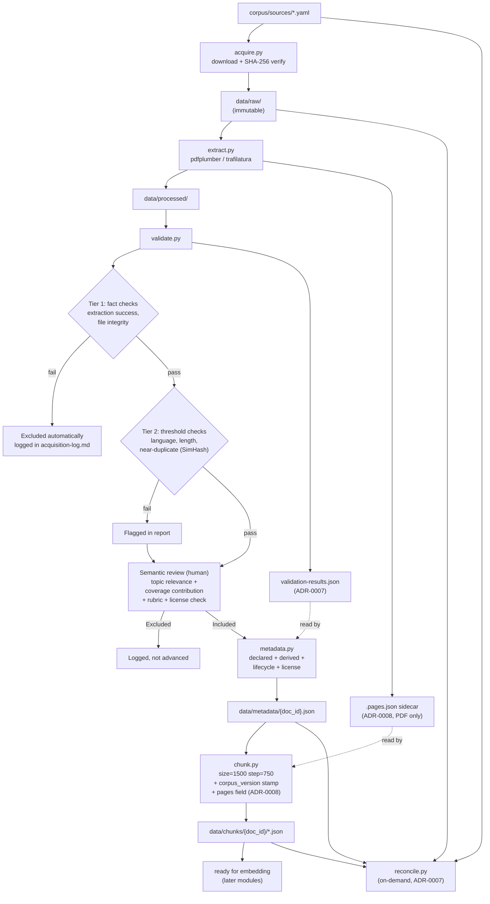

# Ingestion Pipeline Design (Pre-Implementation Reference)

Synthesizes the frozen architecture (now v1.8, `docs/archituecture.md.docx`)
with everything resolved during the 2026-07-11 architecture review
(`docs/adr/0001` through `0004`, `docs/licensing.md`,
`docs/corpus-inclusion-rubric.md`) into one coherent picture of what
`src/ingestion/` will actually do when it's built. This is a design
reference, not a status report — no code exists yet. See
`docs/PROJECT_CONTINUITY.md` for current implementation status.

**Updated 2026-07-20** for ADR-0005 (content checksums for CDN-served
HTML), ADR-0007 (pipeline consistency fixes — validation data flow,
content-drift routing, cross-surface reconciliation, derived-checksum
storage), and ADR-0008 (page-level citation provenance for PDF-sourced
chunks) — all three postdate the 2026-07-11 review and change real
data-flow details in stages 2–5 below plus add a new standalone
diagnostic script. By this point the pipeline **is implemented** — see
`docs/PROJECT_CONTINUITY.md` for the actual current corpus size and
run history; this doc still describes intended design, now kept in sync
with what's actually built rather than only what was originally planned.

---

## The pipeline, stage by stage

### 1. `acquire.py` — get the raw files, prove they haven't changed

**What it does:** reads `corpus/sources/*.yaml` (one YAML per organization,
listing which documents to download and their expected checksums), downloads
each file, verifies its SHA-256 against the manifest, and writes it to
`data/raw/{org}/`. Skips anything already present with a matching checksum
— safe to rerun.

**Why this stage exists:** every later stage depends on having a stable,
verifiable copy of the source material. Without a checksummed download
step, "the corpus" is just a folder of files nobody can prove weren't
corrupted, re-downloaded differently, or silently changed at the source
between runs.

**Connects to:** nothing upstream — this is where the pipeline starts, fed
by the source YAMLs written during corpus design (a separate, earlier,
human-driven process — deciding *which* documents to include is
`docs/corpus-inclusion-rubric.md`'s job, not `acquire.py`'s).

**Produces:** `data/raw/{org}/*.pdf` or `.html` — immutable from this point
forward. Nothing downstream ever modifies these files; if extraction logic
improves later, documents get re-extracted from these same untouched
originals.

**Feeds:** `extract.py`.

**What review added here:** `docs/licensing.md` (item 1) — before a
document is acquired, its organization's licensing terms should already be
on file. Freedom House specifically needs a written permission request
before any redistribution beyond this project's own non-commercial use —
tracked as an open item, not blocking acquisition itself yet.

---

### 2. `extract.py` — turn files into plain text

**What it does:** PDF → plain text via `pdfplumber`. HTML → plain text via
`trafilatura`. Does not clean the text — that's explicitly a later concern.
Flags scanned/image-only PDFs (no extractable text layer) as extraction
failures rather than attempting OCR, which is out of scope for v1.

**Why this stage exists:** everything downstream — validation, chunking,
eventual embedding — operates on text, not PDF byte streams. Separating
extraction from validation means a bad extraction can be diagnosed and
fixed without re-downloading anything.

**Connects to:** reads from `data/raw/` (immutable), never writes back to
it.

**Produces:** `data/processed/{org}/*.txt`, plus, for PDF-sourced documents
only, a sidecar `data/processed/{org}/{doc_id}.pages.json` (ADR-0008) — the
true PDF page number and character range each page of extracted text
occupies in the joined output, format/resolution logic centralized in
`src/ingestion/pages.py`. And, for documents belonging to an org whose
YAML declares `raw_bytes_stable: false` (currently Freedom House), a
`content_sha256` entry bootstrapped into or compared against
`corpus/derived-checksums/{org}.json` (ADR-0005, storage location fixed
by ADR-0007) — the mechanism that actually verifies live-source fidelity
when the org's raw HTML bytes are known to be non-deterministic
CDN-injected markup, since a raw-byte checksum can't do that job for
those sources.

**Feeds:** `validate.py`.

**What review added here:** nothing directly — extraction method choice
(pdfplumber/trafilatura, no OCR) wasn't contested in the review. Worth
remembering per `docs/adr/README.md`'s example trigger thresholds: if more
than roughly 15% of one organization's documents fail extraction, that's a
signal the method needs reconsidering for that org's PDF layout, not a
one-off problem to individually patch.

**What ADR-0007/ADR-0008 changed here (2026-07-20):** a content_sha256
mismatch now also appends a durable entry to `corpus/acquisition-log.md`
(previously only a stderr print, which meant it never actually reached
human review) — see `validate.py` below for the other half of this fix. A
PDF-sourced `.txt` written before ADR-0008 landed has no `.pages.json`
sidecar yet; `extract.py` detects this and forces a one-time
re-extraction rather than treating it as already-done, so the corpus
self-migrates on its next run instead of needing a one-off backfill
script.

---

### 3. `validate.py` — decide what actually belongs in the corpus

This is the stage the review changed the most (ADR-0002). It's two
sub-stages now, with explicit routing between them rather than a uniform
"automated then human" claim that wasn't actually true.

**Tier 1 — fully automated, no human needed:**
- Extraction success (file exists and is non-empty)
- File integrity (SHA-256 matches the manifest)

These are facts, not judgments. A document failing either is excluded
automatically and logged (`exclusion_reason` in `corpus/acquisition-log.md`)
— no human review needed for "the checksum didn't match."

**Tier 2 — automated check, but routed to human confirmation before
exclusion is final:**
- Language detection (`langdetect`, must be English) — probabilistic,
  known to misfire on short or code-switched text, which is close to
  normal for this corpus given real Swahili/English mixing in Kenyan and
  Tanzanian sources. **Seeded deterministically (`DetectorFactory.seed =
  0`) as of ADR-0007** — unseeded, the same document's language could
  flip between runs with no content or code change, which is exactly the
  kind of non-reproducibility a validation gate can't tolerate.
- Minimum length (≥500 words) — a real report can be short and still be
  the exact evidence this corpus exists to hold
- Near-duplicate detection (SimHash against the existing corpus) — a
  similarity threshold despite being labeled "deterministic" in the
  original architecture text; two legitimately different reports about
  related events could plausibly trigger it
- **Content drift (ADR-0007, 2026-07-20):** for documents belonging to a
  `raw_bytes_stable: false` org, recomputes `content_sha256` over the
  current extracted text and compares it against
  `corpus/derived-checksums/{org}.json`. A mismatch is surfaced as a real
  Tier 2 flag here — closing the gap where `extract.py`'s own drift
  detection (ADR-0005) previously only printed to stderr and never
  actually reached this stage's human-review report.

A document failing a Tier 2 check is logged **and** surfaced into the same
report a human reviews for semantic checks — not silently dropped.

**Machine-readable output (ADR-0007, 2026-07-20):** alongside the existing
human-readable `corpus/validation-report.md`, this stage now also writes
`corpus/validation-results.json` — one entry per document with the exact
Tier 1/Tier 2 results in structured form. This exists specifically so
`metadata.py` (stage 4) can read a document's language/word-count facts
from here instead of independently recomputing them a second time, which
is what stage 4's own section below describes.

**Semantic review — always human, using the rubric:**
- Topic relevance and coverage contribution, now with concrete criteria
  and worked examples in `docs/corpus-inclusion-rubric.md` (item 2) instead
  of two undefined phrases. If the document is from Freedom House, the
  reviewer also confirms its rights status against `docs/licensing.md`
  before including it.

**Why this stage exists:** this is the corpus's actual quality gate — the
difference between "documents that exist" and "documents that belong in
an evidentiary corpus with citation obligations."

**Connects to:** reads `data/processed/`. Writes nothing new to disk by
itself beyond the validation report and the acquisition log entry — a
document doesn't get its own artifact until it's Included.

**Produces:** an Included/Excluded decision per document, with a logged
reason, feeding the acquisition log's `status` and `exclusion_reason`
fields (already specified in the architecture's Table 1 schema — no schema
change needed for this).

**Feeds:** `metadata.py`, but only for Included documents.

---

### 4. `metadata.py` — the single source of truth per document

**What it does:** merges `declared` fields (from the source YAML, set at
corpus design time — title, org, countries, publication date, and now
`license`, per item 1) with `derived` fields (computed during extraction/
validation — checksum, word count, extraction method, validation status),
plus two additions from this review: a `lifecycle` block and, later, the
`chunking.corpus_version` stamp (set by the next stage, not this one).

**Data source for word_count/language, corrected 2026-07-20 (ADR-0007):**
these now come from `corpus/validation-results.json` (stage 3's new
output), not a second independent `langdetect` call inside this module.
Before this fix, `validate.py` and `metadata.py` each ran their own
language detection over the same text with no guarantee the two would
agree — and `metadata.py`'s copy was the one written into the corpus's
permanent record. An Included document with no matching
`validation-results.json` entry (or one whose Tier 1 didn't pass) is now
a hard failure here, not a silent recompute-and-continue — that
combination means `validate.py` hasn't actually been (re)run against the
current corpus state, which is itself worth surfacing.

**Why this stage exists:** every other artifact — chunks, eventual
embeddings, evaluation datasets — references a document by `doc_id` and
looks up everything else about it here. One JSON file per document is the
single place that answers "what do we know about this document."

**Connects to:** reads validation results and declared source data;
doesn't touch `data/raw/` or `data/processed/` directly.

**Produces:** `data/metadata/{doc_id}.json`.

**Feeds:** `chunk.py`, and eventually the retrieval layer (later module).

**What review added here (ADR-0003, items 5+6):**
- **`lifecycle` block** — `status` (active/superseded/retracted),
  `superseded_by`/`supersedes` pointers, `reason`, `effective_date`.
  Defaults to `active`. Handles a report being corrected or retracted
  *without* ever reusing or reassigning a `doc_id` — the corrected version
  is a brand-new document with a pointer back, never an edit to the old
  one. `data/raw/` stays immutable; doc IDs stay permanent. Both hard
  rules survive intact.
- **`license` field** (item 1) — populated from `docs/licensing.md`'s
  per-organization findings, so rights status travels with the document
  instead of living only in a separate reference doc.

---

### 5. `chunk.py` — split into retrieval-ready windows

**What it does:** fixed overlapping windows (`chunk_size=1500`,
`chunk_step=750` — explicitly marked provisional in the architecture, not
finalized), each chunk inheriting its parent document's full metadata.
Separate stage from extraction specifically so re-chunking with different
parameters never requires re-extracting.

**Why this stage exists:** retrieval and embedding (later modules) operate
on chunks, not whole documents — a 20-page report is too coarse a unit to
retrieve against a specific question.

**Connects to:** reads `data/processed/` (text) and `data/metadata/`
(to inherit fields), for Included documents only.

**Produces:** `data/chunks/{doc_id}/{chunk_id}.json`.

**Feeds:** embedding and retrieval — later modules, out of scope for this
pipeline.

**What review added here (ADR-0003, item 6):** the `chunking` metadata
block now stamps `corpus_version` at the moment chunking actually runs,
copied from the document's own `declared.corpus_version`. If the corpus is
later updated to a new version without re-chunking everything, a simple
equality check (`chunking.corpus_version == declared.corpus_version`)
detects the drift. Detection, not automatic prevention — proportional to a
solo course project, not a production system.

**Page-level provenance (ADR-0008, 2026-07-20):** each chunk record now
also carries a `"pages"` field — the sorted, deduplicated list of true PDF
page numbers the chunk's character range overlaps (via
`src/ingestion/pages.py`'s `resolve_page_range()`, reading the
`.pages.json` sidecar `extract.py` writes), or `null` for non-PDF sources.
This is what makes a citation constructible against the real source
document's page numbers rather than only "somewhere in this PDF" — the
architecture's core "every answer must cite sources" principle otherwise
had no page-level teeth for PDF sources. Pure addition to the chunk
schema; chunk counts are unaffected.

---

### 5a. `reconcile.py` — cross-check that every corpus-state surface agrees (new, ADR-0007)

**What it does:** a standalone, on-demand diagnostic — not wired into
`pipeline.py`'s automatic sequence, the same way the not-yet-built
`check_drift.py` (ADR-0003) is meant to be run deliberately rather than
as a gate. Checks four independent agreement properties across the five
places corpus state lives: `corpus/sources/*.yaml` (declared) vs.
`corpus/manifest.csv` (acquired); `corpus/acquisition-log.md`'s `##
doc_id — Included` headings (human decision) vs. `data/metadata/*.json`
(what `chunk.py` actually processed); `corpus/derived-checksums/{org}.json`
entries vs. their org's declared `doc_id`s; and `data/metadata/*.json`'s
`chunking.total_chunks` vs. the actual chunk file count in
`data/chunks/{doc_id}/`.

**Why this stage exists:** two concrete failure modes were found
independently by both models in the 2026-07-20 end-of-ingestion-phase
review — a hand-edit typo in the acquisition log's required em-dash
silently drops a document from metadata generation with no error, and a
transient re-acquisition failure on a rerun can silently strand a
document's metadata/chunks pointing at a `doc_id` `acquire.py` no longer
considers acquired. Nothing else in the pipeline would catch either.

**Connects to:** reads every artifact listed above; writes nothing.

**Produces:** a human-readable report of any disagreement found, with a
non-zero exit code if anything disagrees, zero if everything's
consistent.

**Feeds:** nothing automated — a human runs it, reads the report, and
fixes whatever it finds by hand (re-running the specific upstream stage
for the affected `doc_id`, or correcting a typo).

---

### 6. `pipeline.py` — run the above in order

**What it does:** calls the five stages above in sequence, logs what
happened, stops on failure rather than continuing silently. No
orchestration framework, no plugin system — deliberate simplicity, not an
oversight (and, per ADR-0004, `docker-compose.yml` in the repo structure is
about pinning the *runtime environment* for reproducibility, not about
pipeline orchestration — the two are easy to conflate and the architecture
now says so explicitly).

**Why this stage exists:** so running the whole pipeline is one command,
not five manually-sequenced ones, without needing Airflow/Prefect/etc. for
a project this size.

---

## Full flow

---

## What's deliberately not built yet

Everything in "later modules" per the architecture's own out-of-scope
list: vector DB integration, LLM generation, evaluation framework. Also
not built: `check_drift.py` (implied by ADR-0003, a small standalone
script — write it alongside `chunk.py`, not before, and now joined by the
same "on-demand diagnostic" category as the already-built `reconcile.py`),
and the retrieval-time `lifecycle.status` filter (needed once retrieval
exists, not now). Noted here so neither is rediscovered as a surprise
later.

Also not built: sub-page provenance (paragraph/table-cell-level
citations) beyond ADR-0008's page-number granularity, and any
citable-structural-unit equivalent for HTML/JSON sources (their `pages`
field stays `null` — see ADR-0008's "what would trigger a revisit").

## Right-sizing check

Every addition from this review is a metadata field, a routing rule, or a
small standalone script — no new services, no orchestration framework, no
event-sourcing system. Consistent with the architecture's own "sequential
and simple" principle and proportional to a solo course project. Opus was
consulted specifically to keep the supersession design (ADR-0003) from
overshooting into something enterprise-shaped; the same discipline applied
across all four ADRs.
