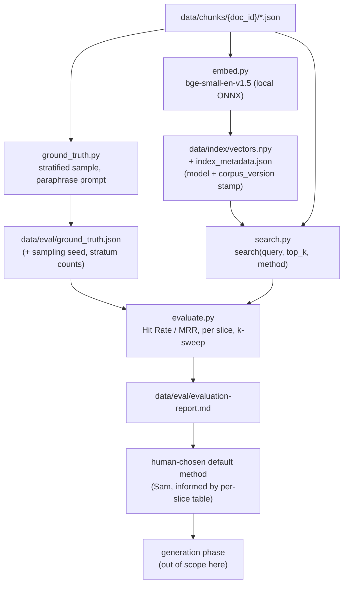

# Retrieval Phase Design (Pre-Implementation Reference)

Synthesizes the frozen architecture (`docs/archituecture.md.docx`, v1.8 —
retrieval is explicitly out of v1.0 scope, a "later module") with
`04-evaluation/project/project_evaluation_plan.md`'s pre-existing Tier 2
evaluation design, plus a 2026-07-22 Opus design review, into one coherent
picture of what `src/retrieval/` will do when it's built. This is a design
reference, not a status report — no code exists yet. Mirrors the shape of
`docs/ingestion-design.md`, written the same way before any ingestion code
existed.

**Phase name: retrieval**, not "embedding/retrieval." Embedding is one
internal stage, not the phase name — same relationship "extraction" had
inside "ingestion."

**Frozen architecture principles this phase inherits, unchanged:**
`data/chunks/` is read-only input here, never modified; the pipeline stays
sequential and simple — no orchestration framework, no abstract interfaces
for hypothetical future methods; any deviation from an already-decided
architecture element requires an ADR. Filling in a genuinely blank design
space (this phase, entirely out of v1.0 scope) is not a deviation and
doesn't need one — same precedent as ingestion's `chunk_size`/`chunk_step`
values, set directly in that design doc, "explicitly marked provisional,"
no ADR filed.

---

## The pipeline, stage by stage

### 1. `embed.py` — compute one embedding vector per chunk

**What it does:** reads every chunk from `data/chunks/{doc_id}/{chunk_id}.json`,
computes an embedding vector per chunk using a local model, and persists
the vectors plus a version stamp to `data/index/` (already reserved in the
architecture's file tree as "embedding vectors and vector store files" —
the one concrete pre-existing hook for this phase).

**Model decision: `BAAI/bge-small-en-v1.5`, via its Xenova ONNX port
(`Xenova/bge-small-en-v1.5`), not the course's own `all-MiniLM-L6-v2`.**
Reasoning:
- **Concrete truncation risk with MiniLM.** This corpus's chunks are
  `chunk_size=1500` characters (~375 tokens) — `all-MiniLM-L6-v2`'s max
  sequence length is 256 tokens, so a meaningful fraction of every chunk
  would be silently truncated before embedding. `bge-small-en-v1.5`'s
  512-token window comfortably covers the full chunk.
- **Task fit.** BGE models are trained specifically for asymmetric
  retrieval — short query, long passage — with a query-side instruction
  prefix ("Represent this sentence for searching relevant passages:").
  MiniLM is a general sentence-similarity model, not tuned for this
  asymmetry. A researcher's short question retrieving a long report
  paragraph is exactly BGE's training task.
- **Same reproducibility class as the course default.** Still small
  (~130MB), fully local, no API key, same download-once-cache-forever
  pattern already proven in this workspace (HW4's `embedder.py`). Not a
  new category of dependency risk.
- **Reversible.** Same function signature either way — if `evaluate.py`'s
  real numbers disagree with this reasoning, swapping back is a one-line
  model-name change, not a redesign.

**Index metadata stamp (fix, Opus review 2026-07-22):** every `embed.py`
run writes `data/index/index_metadata.json` — `embedding_model` (name +
revision), `embedding_dim`, `corpus_version` (per ADR-0003), `chunk_count`,
`created_at`. `search.py` and `evaluate.py` read this stamp first and
**hard-fail**, not warn-and-continue, if the live corpus_version
disagrees. Without this, a re-chunk (which the frozen architecture
explicitly permits without re-extraction) would silently invalidate
ground-truth `correct_chunk_id`s — Hit Rate would just quietly collapse
with no error.

**Corrected 2026-07-22, first real run against the actual corpus:** the
`chunking.corpus_version` stamp is read from `data/metadata/{doc_id}.json`,
not from the chunk record's own embedded `document_metadata` — the latter
never actually carries a `chunking` key at all, a real bug in
`src/ingestion/chunk.py` (its `chunk_document()` writes each chunk file
before `update_metadata_with_chunking()` adds the block to the same
in-memory dict). `corpus/CORPUS_VERSION`'s real content is also
`"<version> <date>"` (e.g. `"v1.0 2026-07-13"`), not a bare version
string — only the leading token is compared. Full root-cause detail in
`decisionlog.md`, 2026-07-22. This changes only where the stamp is read
from, not the stamp's purpose or the hard-fail behavior described above.

**Connects to:** reads `data/chunks/` only.

**Produces:** `data/index/vectors.npy` (persisted, not recomputed per
run) + `data/index/index_metadata.json` + a chunk_id-to-row mapping.

**Feeds:** `search.py`.

---

### 2. `search.py` — one interface, three interchangeable backends

**What it does:** a single function, `search(query, top_k, method) ->
ranked chunks`, with three backends:
- **text** — keyword search (BM25-style, via `minsearch`, same library
  already used in this course).
- **vector** — cosine similarity against `data/index/`'s persisted
  vectors, embedding the query with the same BGE model (query-instruction
  prefix applied).
- **hybrid** — **Reciprocal Rank Fusion (RRF)**, combining the text and
  vector rankings: `score(chunk) = sum over rankers of 1 / (k + rank)`,
  with `k` tunable. Default `k` comes from `evaluate.py`'s sweep (below),
  not assumed — Module 4's own homework showed `k` genuinely moves the
  winner on a real corpus, not a formality.

**Why this shape:** `project_evaluation_plan.md` explicitly requires the
evaluation harness to be "written generically against a `search_function`
parameter" so it scores any method unmodified. Swapping
`method="text"/"vector"/"hybrid"` must never require touching
`evaluate.py`.

**Connects to:** reads `data/index/` (checks the version stamp first),
reads `data/chunks/` for text/metadata lookups.

**Produces:** nothing persisted — a pure function.

**Feeds:** `evaluate.py` now; the generation phase later (out of this
phase's scope — see below).

---

### 3. `ground_truth.py` — chunk-level questions, built to avoid circularity

**What it does:** samples a **stratified subset** of chunks (not all
3,783 — cost/time control), across orgs/countries, deliberately
oversampling the harder categories `project_evaluation_plan.md` already
named: multi-country documents, OONI-methodology-only questions,
thin/contradictory-evidence cases. Generates one question per sampled
chunk via LLM, using a researcher/journalist framing prompt, not a
generic-FAQ framing.

**Circularity fix (Opus review 2026-07-22):** synthetic questions
generated directly from a chunk tend to lexically echo it, which
structurally inflates keyword search's apparent win rate — this may be
part of why Module 4's own homework found keyword beating vector search,
not purely a corpus property. The generation prompt now explicitly
instructs paraphrase/abstraction — ask about the chunk's substance
without quoting or mirroring its exact phrasing. After generation, a
small manual-review slice (~20–30 pairs) gets hand-checked by Sam for
residual circularity before `evaluate.py`'s results are trusted. Required
step, not optional.

**Known gap, INITIAL DIAGNOSIS WAS WRONG — corrected 2026-07-22, same
day, via Sam's manual review.** First diagnosis (below, struck through
in spirit not in text — kept for the record): the `ooni_methodology`
stratum (target 20) sampled **0** against the real corpus, attributed to
the corpus genuinely having no dedicated OONI methodology document
(checking `corpus/sources/ooni.yaml`, all 6 OONI documents are
incident/country reports). Decision at the time: accept it as a v1
corpus gap, don't reopen ingestion.

**That diagnosis was incomplete.** Sam's required manual circularity
review (the very check this stratification feeds into) surfaced a
`general`-categorized OONI chunk
(`ooni-tz-2025-x-platform-blocking-chunk-0025`) that is explicitly about
OONI's own measurement methodology — TCP/TLS timeout and reset error
analysis, explicitly discussing "OONI Probe testing" and "measurement"
coverage, both literal `OONI_METHODOLOGY_KEYWORDS` matches. It should
never have classified as `general`. Root cause, found by reading
`classify_category()` directly: `if chunk["organization"] == "ooni"` was
comparing against a lowercase literal, but
`corpus/sources/ooni.yaml`/`data/metadata/{doc_id}.json` store
`organization: OONI` (uppercase) — the branch was unreachable
regardless of chunk content, on every run, for every OONI chunk. Fixed:
`chunk["organization"].lower() == "ooni"`. The corpus may well contain
real methodology-adjacent content after all (OONI's own analysis
sections routinely explain their measurement/test-helper methodology
inline when presenting findings, not only on a dedicated methodology
page) — this needs a re-run of `ground_truth.py` to actually find out,
not another documented-and-accepted guess. Sam's earlier "option 1,
leave it" decision was made on a false premise and is superseded by
this entry, not still in effect.

**Connects to:** reads `data/chunks/`.

**Produces:** `data/eval/ground_truth.json` —
`{question, correct_chunk_id, doc_id, category}` per row, plus the
sampling seed and per-stratum counts recorded alongside it, so the sample
itself is reproducible.

**Feeds:** `evaluate.py`.

---

### 4. `evaluate.py` — Hit Rate/MRR, per method, per slice, k-swept

**What it does:** for each search method (text/vector/hybrid) — and for
hybrid, each RRF `k` in a sweep range, mirroring Module 4 HW4's own
k-sweep — runs every ground-truth question through `search()` and
computes Hit Rate and MRR, both in aggregate and **broken out per
category slice** defined by `ground_truth.py`'s stratification.

**Method-selection fix (Opus review 2026-07-22):** does not auto-crown a
winner from the aggregate score alone. Produces a report table with
per-slice breakdowns; the default method for the next phase is a
documented **human** decision informed by that table — explicitly
including whether the winning method still holds up on the
thin/contradictory-evidence slice, since `project_evaluation_plan.md`
names citation-adjacent, evidence-quality performance as the project's
most safety-relevant concern, not aggregate Hit Rate alone.

**Connects to:** reads `data/eval/ground_truth.json`, calls `search.py`.

**Produces:** `data/eval/evaluation-report.md` (per-method, per-slice,
per-k results) and a recorded default-method decision.

**Feeds:** nothing automated — Sam reads the report and picks the
default, which becomes the generation phase's starting config.

---

## Full flow

---

## Where this phase ends

**Done means:** a working, evaluated, versioned
`search(query, top_k, method) -> ranked chunks` function, backed by a
persisted and stamped vector index, with a human-chosen default method
informed by per-slice Hit Rate/MRR results and a tuned RRF `k`. Concrete
artifacts: `data/index/` (vectors + stamp), `data/eval/ground_truth.json`,
`data/eval/evaluation-report.md`, and a recorded default-method decision.

**Explicitly not in this phase** (separate phases, each consuming this
phase's output without modifying it):
- **Generation** — an LLM producing a cited answer and flagging
  thin/contradictory evidence. Calls `search()` as an input; doesn't
  change it.
- **LLM evaluation** — evaluating *generated answers*, a separate rubric
  line, only possible once generation exists.
- **Reranking** and **query rewriting** — both course "best practices"
  bonus items. Architecturally these slot in as an optional layer
  downstream (reranking, re-scoring `search()`'s top results) or upstream
  (query rewriting, before a query reaches `search()`) of this phase's
  interface — addable later without reopening this design.

**Worth flagging, not deciding now:** implementing and evaluating hybrid
search with RRF already appears to satisfy the rubric's "Best practices:
hybrid search" bonus on its own, since it's part of this phase's base
build rather than a separate add-on. The 14-post calendar's post 12
"best practices" slot may be better spent on reranking or query rewriting
specifically, to avoid re-covering ground already earned here — revisit
when that post's trigger actually arrives, not now.

---

## What's deliberately not built yet

Everything the architecture scopes as "later modules": the generation
layer, the LLM evaluation framework, the eventual CLIO-facing read-only
API contract (noted in the architecture as needing its own versioned
definition once the retrieval layer is a service, not before). Also not
built in this phase: reranking, query rewriting (see above — optional,
separable), and any retrieval-time filter on `metadata.lifecycle.status`
(only matters once a document has actually been superseded — none have
been yet).

## Right-sizing check

Every piece above is a small standalone script, a metadata stamp, or a
report file — no new services, no vector database beyond an in-memory
persisted array, no orchestration framework. Consistent with the
architecture's "sequential and simple" principle and the ingestion
phase's own precedent. Opus was consulted specifically to pressure-test
the module boundaries and the three open decisions (embedding model,
vector store, ground-truth scope) before implementation — same discipline
applied to every ADR-worthy call in the ingestion phase.
